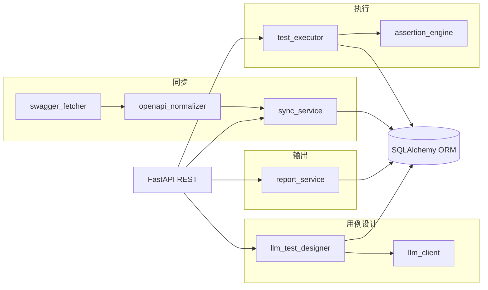

# API 自动化测试编排服务（MVP）

基于 **FastAPI + SQLAlchemy + SQLite（可换 PostgreSQL）** 的 Swagger/OpenAPI 同步、LLM 生成结构化用例、HTTP 执行器与报告持久化。

## 高层架构



## 目录结构

```
.
├── app/
│   ├── main.py                 # FastAPI 入口、全局异常、健康检查
│   ├── config.py               # pydantic-settings 环境变量
│   ├── api/
│   │   ├── routes.py           # REST：服务、同步、生成用例、执行、报告
│   │   └── schemas.py          # 请求/响应 Pydantic 模型
│   ├── db/
│   │   ├── base.py
│   │   ├── session.py          # engine、Session、init_db(create_all)
│   │   └── models.py           # 表：服务、快照、同步任务、endpoint、套件、用例、run、结果、报告
│   ├── schemas/
│   │   └── test_case_schema.py # LLM 输出 JSON Schema + jsonschema 校验
│   ├── services/
│   │   ├── swagger_fetcher.py
│   │   ├── openapi_normalizer.py
│   │   ├── sync_service.py
│   │   ├── llm_client.py       # LangChain ChatOpenAI → OpenAI 兼容 /v1/chat/completions
│   │   ├── llm_test_designer.py
│   │   ├── test_executor.py    # {{var}}、extract、多步顺序执行
│   │   ├── assertion_engine.py # status / jsonpath / header / body_contains
│   │   └── report_service.py   # JSON/HTML/Markdown + DB 元数据
│   └── utils/
│       ├── errors.py           # ErrorCode、AppError、retryable
│       ├── redact.py           # 日志/报告脱敏
│       └── http_exc.py         # AppError → HTTP 状态码
├── frontend/                   # React + Vite 管理控制台（与 /api/v1 对齐，见 frontend/README.md）
├── tests/                      # 解析、Schema、变量替换、脱敏
├── data/                       # 运行时 SQLite 与报告（gitignore）
├── requirements.txt
├── .env.example
└── README.md
```

## 数据库设计要点

| 表 | 作用 | 主键/唯一/索引 |
|----|------|----------------|
| `target_service` | 被测服务元数据 | PK `id` |
| `swagger_snapshot` | 每次拉取的 spec 全文 + `content_hash` | `service_id` + `fetched_at` 查询最新；`content_hash` 增量 |
| `sync_job` | 单次同步任务与统计 | FK `service_id` |
| `endpoint` | 归一化接口 | **唯一** `(service_id, method, path)`；`fingerprint` 检测片段变更 |
| `test_suite` | LLM 生成批次 | FK `endpoint_id` 可选、`snapshot_id` 版本钉扎 |
| `test_case` | 可执行步骤 JSON | FK `suite_id`；`status`: draft/approved |
| `test_run` | 一次执行 | FK `suite_id`；`target_base_url` |
| `test_result` | 每用例结果与快照（已脱敏 header） | FK `run_id`, `case_id` |
| `report` | 报告文件路径 + `summary_json` | FK `run_id` |

迁移：当前 MVP 使用 `Base.metadata.create_all()`（见 `init_db()`）。生产可接入 **Alembic**，以 `app/db/models.py` 为单一事实来源生成 revision。

**MySQL 已有库**：若同步时报 `Data too long for column 'raw_spec_json'`，说明列仍是 64KB 级 `TEXT`，请执行：

```sql
ALTER TABLE swagger_snapshot MODIFY COLUMN raw_spec_json LONGTEXT NOT NULL;
ALTER TABLE endpoint MODIFY COLUMN spec_json LONGTEXT NOT NULL;
```

（新建库且由当前 ORM 建表时，`swagger_snapshot.raw_spec_json` / `endpoint.spec_json` 在 MySQL 上已为 `LONGTEXT`。）

**自动升级**：启动时 `init_db()` 会检测 MySQL/MariaDB 中上述列类型，若为普通 `TEXT`/`VARCHAR` 等则自动 `ALTER` 为 `LONGTEXT`（见 `app/db/session.py`）。

**本机 Postman/curl 命中代理**：若访问 `http://127.0.0.1:8000` 却返回公司网关 HTML/504，请在系统或 Postman 中为 `127.0.0.1,localhost` 设置 **绕过代理（NO_PROXY）**，否则请求到不了 uvicorn，`root.log` 也不会有对应行。

**LLM 报 `CERTIFICATE_VERIFY_FAILED` / 自签证书链**：多为公司 HTTPS 解密代理。优先在 `.env` 设置 **`LLM_CA_BUNDLE`** 为公司根证书 PEM 路径；仅在可信内网排障时可设 **`LLM_VERIFY_SSL=false`**（关闭校验，有中间人风险）。改后需重启 uvicorn；`get_settings()` 有缓存。

**执行用例访问被测服务时的 HTTPS 证书**：与 LLM 无关。配置 **`EXECUTOR_CA_BUNDLE`**（PEM 路径，优先）或 **`EXECUTOR_VERIFY_SSL=false`**（仅排障，不安全）；`test_executor` 里 `httpx.Client(verify=…)` 会生效。  
**报告里「期望 200/422，实际 504」**：**504 是网关超时**，常见于 Nginx/代理在 **`HTTP_TIMEOUT_SECONDS`（默认 30s）** 内未等到上游响应；**明文 `http://` 目标不涉及 TLS 证书**。请检查 `100.100.135.210:8080` 路由是否可达、上游是否过慢，或适当**加大 `HTTP_TIMEOUT_SECONDS`**。

**单 endpoint 生成「一直转圈」**：接口要等 **整次 LLM 完成** 才返回。若网关误开 **流式**，旧版客户端可能长时间读不完；当前已在请求体中固定 **`stream": false`**。超时由 **`LLM_TIMEOUT_SECONDS`**（默认 120s）控制，与执行用例的 **`HTTP_TIMEOUT_SECONDS`** 无关；模型慢或 `spec_json` 极大时可加大前者。日志（`app.services.llm_client`）会打 `LLM api_url` / `request body` / `response`，便于区分卡在请求前、HTTP 还是解析。

**调试时不要无限等 POST**：生成类接口可能接近 `LLM_TIMEOUT_SECONDS` 才返回。用 curl 探测时请加大上限或接受超时，例如 `curl --connect-timeout 5 --max-time 25 ...`：若在 `max-time` 内无 HTTP 响应，说明处理仍卡在服务端（多为 LLM 同步调用）；对照 `root.log` 中同一 `request id` 是否已有 `-->` 而无 `<--`，或是否已出现 `LLM api_url=`。

**`POST /api/v1/endpoints/{id}/generate-cases` 分步追踪**（`app.generate_cases.trace`，写入 `root.log`）：每条请求有唯一 `[trace=xxxxxxxxxxxx]`。按顺序对照，**最后出现的一条之后**即为卡点。

| 步骤 | 含义 |
|------|------|
| GC-01～03 | 进入路由、构造 `LLMTestDesigner`、调用 `generate_for_endpoint` |
| GC-10～13 | 进入 designer、`db.get(Endpoint)`、拼 prompt |
| GC-14 | 即将调用 LLM（若此后长时间无 GC-15，卡在 LLM） |
| GC-30～31 | 进入 `chat_json`、即将 `httpx` POST（若 GC-31 后有 GC-32，说明 HTTP 已返回） |
| GC-32～34 | POST 返回、解析 JSON 信封、取出 `content` |
| GC-15 | LLM 文本已回到 designer |
| GC-16～19 | 解析 LLM 输出 JSON、Schema 校验 |
| GC-20～24 | 写库 flush/commit/refresh |
| GC-99 | 路由即将返回；GC-ERR 为业务 `AppError` |

批量 `generate-cases-batch` **不会**打上述 trace（未调用 `trace_begin`），避免日志爆炸。

**POST 很快 404、不像在等 LLM**：若路径**没有**前缀 `/api/v1`，Starlette 会直接 **404**（`{"detail":"Not Found"}`），请求根本不会进业务逻辑，因此**不会**出现长时间等待。正确示例：`POST /api/v1/services/{id}/generate-cases-batch`。若漏了前缀，响应头会带 **`X-API-Hint`** 提示。业务里「服务不存在」也是 404，但 body 为 `detail: { "code": "NOT_FOUND", "message": "..." }`，可与路由未命中区分。

## HTTP API（核心）

| 方法 | 路径 | 说明 |
|------|------|------|
| POST | `/api/v1/services` | 注册服务（name、base_url、swagger_url） |
| GET | `/api/v1/services` | 列表 |
| GET | `/api/v1/services/{id}/endpoints` | 同步后的 endpoint 列表 |
| GET | `/api/v1/services/{id}/stats` | endpoint 数量 |
| POST | `/api/v1/services/{id}/sync` | 触发 Swagger 拉取与 upsert（body 可带 `swagger_url`、`fetch_headers`） |
| POST | `/api/v1/endpoints/{id}/generate-cases` | LLM 生成用例并入库（需 `LLM_API_KEY`）；响应体为套件元数据，**`id` 即 `suite_id`** |
| GET | `/api/v1/endpoints/{id}/suites` | 该 endpoint 下套件列表（按创建时间倒序） |
| GET | `/api/v1/services/{id}/suites` | 该服务下全部套件列表 |
| GET | `/api/v1/suites/{suite_id}` | 单个套件元数据 |
| GET | `/api/v1/suites/{suite_id}/test-cases` | **查看套件内全部用例**（含 `steps_json`、`variables_json`、`status`） |
| POST | `/api/v1/services/{id}/generate-cases-batch` | **批量** LLM 生成：可选 `endpoint_ids`（缺省=该服务全部）、`limit`、`suite_name_prefix`、`approve`、`continue_on_error` |
| POST | `/api/v1/suites/{id}/run` | 执行套件内用例；可选 `only_approved`、`target_base_url`、生成报告 |
| POST | `/api/v1/services/{id}/run-suites-batch` | **批量** 执行：可选 `suite_ids`（缺省=该服务下所有套件）；每套件一次 `test_run` + 可选报告 |
| GET | `/api/v1/runs/{id}` | 查询运行状态 |
| GET | `/api/v1/runs/{id}/reports` | 报告列表（含 `storage_path`） |

错误体：`{ "code", "message", "retryable", "details" }`。Swagger 拉取失败、LLM 5xx/429 等会标为可重试并映射 **503**。

**生成后如何查看用例**：单次生成接口返回的 JSON 里 **`id` 就是 `suite_id`**。浏览器或 Postman 调用 **`GET /api/v1/suites/{suite_id}/test-cases`** 即可看到每条用例的 `name`、`steps_json`、`variables_json` 等。批量生成时响应里的 `suites[].id` 同理；也可先 **`GET /api/v1/services/{service_id}/suites`** 或 **`GET /api/v1/endpoints/{endpoint_id}/suites`** 再选套件。数据库表为 **`test_case`**（与 `test_suite` 外键关联）。

**如何执行用例并生成测试报告**：

1. **准备 `suite_id`**：见上节；确认套件下有用例（`GET .../test-cases`）。
2. **准备被测 Base URL**：执行时会把用例里的 `path` 拼到该地址上。可在 `.env` 配置 **`DEFAULT_TARGET_BASE_URL`**，或在请求体里覆盖 **`target_base_url`**（需能从运行本服务的环境访问到，例如 `http://192.168.x.x:8080`）。
3. **触发执行（单套件）**  
   `POST /api/v1/suites/{suite_id}/run`  
   Body 示例：`{"target_base_url": "http://localhost:8080", "only_approved": false, "generate_reports": true}`  
   - **`only_approved`**：为 `true` 时只跑状态为 **`approved`** 的用例；生成时若未传 `approve: true`，用例默认为 **`draft`**，此时须设为 **`false`** 才会执行。  
   - **`generate_reports`**：默认 **`true`**，跑完后在磁盘写入 **JSON / HTML / Markdown** 并在库里登记 **`report`** 记录。
4. **看结果**  
   - 响应体为 **`TestRun`**，记下 **`id` 即 `run_id`**，字段 **`status`** 为 `success` / `failed` / `partial`。  
   - **`GET /api/v1/runs/{run_id}`**：再次查询运行摘要。  
   - **`GET /api/v1/runs/{run_id}/reports`**：每条报告的 **`storage_path`** 为本机绝对路径，可直接打开 **`report.html`** / **`report.md`** / **`report.json`**。  
   - 报告目录约定：项目下 **`data/reports/{run_id}/`**（与 `report_service` 一致）。
5. **多套件批量执行**：`POST /api/v1/services/{service_id}/run-suites-batch`，可选 **`suite_ids`**；不传则该服务下**所有套件**各产生一次 `test_run`；同样支持 **`target_base_url`**、**`only_approved`**、**`generate_reports`**。

## 运行

```bash
cd 测试系统
copy .env.example .env   # 填写 LLM_API_KEY 等
pip install -r requirements.txt
uvicorn app.main:app --reload --host 0.0.0.0 --port 8000
```

### Web 控制台（可选）

```bash
cd frontend
npm install
npm run dev
```

浏览器访问 **http://127.0.0.1:5173**。开发模式下 Vite 将 `/api`、`/health` 代理到 `127.0.0.1:8000`；若前端与后端不同源部署，请设置 **`CORS_ORIGINS`**（见 `.env.example`）及前端的 **`VITE_API_BASE`**（见 `frontend/README.md`）。

- LLM 调用依赖 **LangChain**（`langchain-openai` + `langchain-core`），仍走 OpenAI 兼容 `base_url`；`LLM_CA_BUNDLE` / `LLM_VERIFY_SSL` 通过注入 **`httpx.Client`** 生效；`max_retries=0` 与直连行为接近，避免 SDK 默认重试拉长等待。
- 交互文档：<http://127.0.0.1:8000/docs>
- 文件日志（默认）：`D:/applog/<APP_NAME>/root.log`（约 10MB 轮转，保留 5 个备份）。**本机任意进入 FastAPI 的 HTTP 请求**（含 Postman）由中间件 `app.request` 写 `-->` / `<--` 行，并与 `uvicorn.access` 共用同一文件 Handler；`import app.main` 时即初始化，避免早于 lifespan 的请求不落盘。级别由 `apply_forced_log_levels` 固定为 INFO（或 DEBUG），避免默认 `root=WARNING` 丢日志。无法建立 TCP、或未打到本机 uvicorn 端口的请求不在此列。
- 将 `DATABASE_URL` 改为 `postgresql+psycopg://...` 即可使用 PostgreSQL（需安装 `psycopg[binary]`）。

## 单元测试

```bash
pytest tests -q
```

## 设计约束（与需求对齐）

- **LLM 不执行 HTTP**：仅生成符合 Schema 的结构化用例；执行完全在 `test_executor`。
- **执行器可独立重跑**：已入库的 `test_case` 不依赖再次调用 LLM。
- **敏感信息**：`redact_headers` 用于结果快照；日志侧可用 `redact_for_log`。

### 如何让模型遵守 `test_case_schema`（方案建议）

| 手段 | 说明 |
|------|------|
| **Prompt 与 Schema 一致** | 旧版曾写「dependencies 写 unknown 字符串」，与 Schema（`string[]`）冲突，会系统性带偏模型；已在 `llm_test_designer` 的 System/User 中改为 `["unknown"]` 并写明 `id` / `name` / `steps` 必填。 |
| **结构摘要 + 最小示例（Few-shot 骨架）** | 在 User 中嵌入与真实校验器一致的字段说明 + 一行合法 JSON 示意，比只写「输出 JSON」有效得多；执行层字段见 `app/schemas/test_case_schema.py`。 |
| **`response_format: json_object`** | 已启用，减少胡扯前缀，但不保证嵌套字段齐全，仍需上文约束。 |
| **校验失败自动重试（可选后续）** | 将 `jsonschema` 的 `errors` 拼进第二轮 User：「上次错误如下，请只输出修正后的 JSON」，常能一次修好格式问题（注意 token 与延迟）。 |
| **更强/更听话的模型** | 小模型易偷懒成「扁平用例」；换更大模型或明确禁止 `expected_status` 扁平字段，只允许多步 `steps`。 |
| **两阶段生成（可选后续）** | 先让模型只输出用例意图列表，再由第二步展开为带 `steps` + `assertions` 的完整结构，降低单次 JSON 复杂度。 |

实现上：**契约以 `LLM_TEST_DESIGN_SCHEMA` 为唯一真相**；Prompt 应用自然语言复述同一契约，并避免与 Schema 矛盾的示例。

## TODO（后续增强）

- Celery/RQ 异步化同步与大批量生成
- 更完整的 `$ref` / 远程引用解析
- 删除同步后已消失的 path、多接口 bundle 提示词与路由
- `test_case` 人工审核工作流与 CI 仅 `approved`
