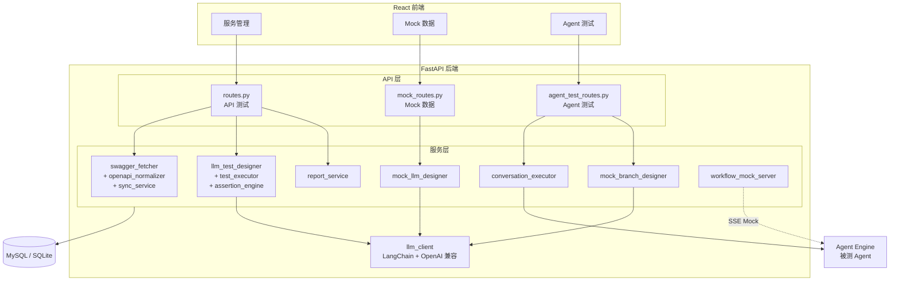

# 测试编排系统

基于 **FastAPI + React + SQLAlchemy** 的一体化测试编排平台，覆盖 API 自动化测试、Mock 数据管理、AI Agent 多轮对话测试三大场景。

## 平台能力一览

| 领域 | 核心功能 |
|------|---------|
| **API 测试** | Swagger/OpenAPI 同步 → LLM 自动生成用例 → HTTP 执行器 → JSON/HTML/Markdown 报告 |
| **Mock 数据** | 场景化 Mock 表 + API 规则 + 运行时状态覆盖 + LLM 辅助生成 Mock 设计 |
| **Agent 测试** | 多轮对话编排 → 多协议适配 (OpenAI/AgentEngine/Dispatch) → 流式执行 → Mock Profile 数据驱动 → LLM 分支生成 |

## 架构总览



## 目录结构

```
.
├── app/
│   ├── main.py                        # FastAPI 入口、lifespan、全局异常、健康检查
│   ├── config.py                      # pydantic-settings，读取 .env
│   ├── api/
│   │   ├── routes.py                  # API 测试：服务、同步、生成用例、执行、报告
│   │   ├── schemas.py                 # API 测试 Pydantic 模型
│   │   ├── mock_routes.py             # Mock 数据平台：场景、表、规则、映射、LLM 生成
│   │   ├── mock_schemas.py            # Mock 平台 Pydantic 模型
│   │   ├── agent_test_routes.py       # Agent 测试：目标、场景、轮次、执行、Mock Profile、分支生成
│   │   └── agent_test_schemas.py      # Agent 测试 Pydantic 模型
│   ├── db/
│   │   ├── base.py                    # SQLAlchemy DeclarativeBase
│   │   ├── session.py                 # Engine、Session、init_db、自动迁移
│   │   └── models.py                  # 全部 ORM 模型（22 张表）
│   ├── schemas/
│   │   └── test_case_schema.py        # LLM 输出 JSON Schema 校验
│   ├── services/
│   │   ├── swagger_fetcher.py         # 拉取 OpenAPI spec
│   │   ├── openapi_normalizer.py      # 归一化 OpenAPI 2/3 → endpoint 列表
│   │   ├── sync_service.py            # Swagger 同步（快照、hash、upsert）
│   │   ├── llm_client.py             # LangChain ChatOpenAI 封装
│   │   ├── llm_test_designer.py       # LLM 生成 API 测试用例
│   │   ├── test_executor.py           # HTTP 执行器（变量替换、多步、断言）
│   │   ├── assertion_engine.py        # 断言：status_code / jsonpath / header / body_contains
│   │   ├── report_service.py          # JSON / HTML / Markdown 报告生成
│   │   ├── mock_llm_designer.py       # LLM 生成 Mock 表结构与规则
│   │   ├── conversation_executor.py   # 多轮对话执行器（多协议、流式、Mock 集成）
│   │   ├── mock_branch_designer.py    # LLM 生成 Mock 数据分支 + 对话场景
│   │   └── workflow_mock_server.py    # 工作流 Mock 服务器（内嵌 + 独立双模式）
│   └── utils/
│       ├── errors.py                  # ErrorCode、AppError、retryable
│       ├── redact.py                  # 日志/报告脱敏
│       └── http_exc.py               # AppError → HTTP 状态码映射
├── frontend/                          # React + Vite + TypeScript 管理控制台
│   ├── src/
│   │   ├── App.tsx                    # 路由与布局
│   │   ├── api/client.ts             # 后端 API 客户端
│   │   └── pages/
│   │       ├── ServiceList.tsx        # 服务列表 & 注册
│   │       ├── ServiceDetail.tsx      # 服务详情：同步、接口、批量生成/执行
│   │       ├── EndpointCasesPage.tsx  # 单接口：套件、用例、执行
│   │       ├── SuiteDetail.tsx        # 套件详情：用例列表、执行、报告
│   │       ├── RunDetail.tsx          # 执行结果 & 报告查看
│   │       ├── MockScenarioList.tsx   # Mock 场景列表
│   │       ├── MockScenarioDetail.tsx # Mock 场景详情：表、规则、映射
│   │       ├── AgentTestList.tsx      # Agent 目标列表、发现/导入、场景管理
│   │       ├── AgentScenarioDetail.tsx# 对话场景：轮次编排、Mock Profile、流式执行
│   │       └── MockBranchSkillPage.tsx# 分支生成 Skill 管理
│   └── package.json
├── data/                              # 运行时 SQLite & 报告（gitignore）
├── requirements.txt
├── .env.example
└── README.md
```

## 数据模型

### API 测试

| 表 | 说明 |
|----|------|
| `target_service` | 被测服务元数据（name、base_url、swagger_url） |
| `swagger_snapshot` | 每次拉取的 spec 全文 + content_hash |
| `sync_job` | 同步任务记录与统计 |
| `endpoint` | 归一化接口，唯一 `(service_id, method, path)` |
| `test_suite` | LLM 生成批次 |
| `test_case` | 可执行多步用例（steps_json + assertions） |
| `test_run` | 一次执行记录 |
| `test_result` | 每用例结果与快照 |
| `report` | 报告文件路径 + 摘要 |

### Mock 数据平台

| 表 | 说明 |
|----|------|
| `mock_scenario` | Mock 场景（业务维度） |
| `mock_data_table` | 场景下的数据表（schema_json + rows_json） |
| `mock_data_table_runtime_state` | 运行时数据覆盖 |
| `mock_api_rule` | API 匹配规则与响应模板 |
| `mock_endpoint_mapping` | 外部 endpoint 到 Mock 规则的映射 |

### Agent 多轮对话测试

| 表 | 说明 |
|----|------|
| `agent_target` | Agent 端点（chat_url、api_format、认证配置） |
| `conversation_scenario` | 对话场景（关联 agent_target，可选 active_mock_profile_id） |
| `conversation_turn` | 场景中的单轮定义（user_message + 期望断言） |
| `agent_test_run` | 一次场景执行 |
| `turn_result` | 每轮实际结果（含 request_snapshot、raw_response） |
| `mock_profile` | Mock 数据配置集（profile_data JSON，绑定场景） |
| `mock_branch_skill` | 分支生成 Skill（可自定义 system_prompt） |

## HTTP API

### API 测试编排

| 方法 | 路径 | 说明 |
|------|------|------|
| POST | `/api/v1/services` | 注册服务 |
| GET | `/api/v1/services` | 列表 |
| POST | `/api/v1/services/{id}/sync` | 触发 Swagger 同步 |
| GET | `/api/v1/services/{id}/endpoints` | 同步后 endpoint 列表 |
| POST | `/api/v1/endpoints/{id}/generate-cases` | LLM 生成用例 |
| POST | `/api/v1/services/{id}/generate-cases-batch` | 批量 LLM 生成 |
| POST | `/api/v1/suites/{id}/run` | 执行套件 |
| POST | `/api/v1/services/{id}/run-suites-batch` | 批量执行 |
| GET | `/api/v1/runs/{id}` | 查询运行状态 |
| GET | `/api/v1/runs/{id}/reports` | 报告列表 |

### Agent 多轮对话测试

| 方法 | 路径 | 说明 |
|------|------|------|
| POST | `/api/v1/agent-test/targets` | 创建 Agent 端点 |
| GET | `/api/v1/agent-test/targets` | 列出所有端点 |
| POST | `/api/v1/agent-test/discover` | 从 Agent Engine 发现 Agent |
| POST | `/api/v1/agent-test/discover/import` | 批量导入发现的 Agent |
| POST | `/api/v1/agent-test/scenarios` | 创建对话场景 |
| POST | `/api/v1/agent-test/scenarios/{id}/turns` | 添加对话轮次 |
| PUT | `/api/v1/agent-test/turns/{id}` | 编辑轮次 |
| POST | `/api/v1/agent-test/turns/{id}/execute` | 单独执行某轮 |
| POST | `/api/v1/agent-test/scenarios/{id}/run` | 执行整个场景 |
| POST | `/api/v1/agent-test/scenarios/{id}/run-stream` | 流式执行（SSE 逐轮推送） |
| POST | `/api/v1/agent-test/scenarios/{id}/mock-profiles` | 创建 Mock Profile |
| POST | `/api/v1/agent-test/mock-profiles/{id}/activate` | 激活 Profile |
| POST | `/api/v1/agent-test/scenarios/{id}/generate-branches` | LLM 一键生成测试分支 |
| GET | `/api/v1/agent-test/mock-branch-skills` | 列出分支生成 Skill |

### Mock 工作流服务器

主应用启动时自动拉起独立 Mock 服务器（默认端口 30001）：

| 端点 | 说明 |
|------|------|
| `GET /health` | 健康检查 |
| `POST /v1/chat/{conversation_id}` | 旧版工作流入口 |
| `POST /v1/0/agent-manager/workflows/{wf_id}/conversations/{conv_id}` | 新版工作流入口（VersatileProxy 兼容） |

内嵌路由（主应用端口 8000，数据源为 MockProfile）：

| 端点 | 说明 |
|------|------|
| `POST /mock-workflow/{profile_id}/v1/chat/{conversation_id}` | Profile 数据驱动的 Mock |
| `GET /mock-workflow/{profile_id}/health` | Profile 健康检查 |

支持的工作流类型：理财推荐、余额查询、转账（基于关键词自动路由）。

## 快速开始

### 后端

```bash
cd 测试系统
copy .env.example .env          # 编辑 .env，填写 LLM_API_KEY 等
pip install -r requirements.txt
uvicorn app.main:app --reload --host 0.0.0.0 --port 8000
```

启动后：
- 主服务：http://127.0.0.1:8000
- API 文档：http://127.0.0.1:8000/docs
- Mock 工作流服务器：http://127.0.0.1:30001（自动启动）

### 前端

```bash
cd frontend
npm install
npm run dev
```

浏览器访问 http://127.0.0.1:5173，Vite 自动代理 `/api` 到后端。

## 环境变量 (.env)

| 变量 | 默认值 | 说明 |
|------|--------|------|
| `DATABASE_URL` | `sqlite:///./data/app.db` | 数据库连接，支持 SQLite / MySQL / PostgreSQL |
| `LLM_API_KEY` | — | LLM API 密钥（必填，OpenAI 兼容） |
| `LLM_BASE_URL` | `https://api.openai.com/v1` | LLM 接口地址 |
| `LLM_MODEL` | `gpt-4o-mini` | 模型名称 |
| `LLM_TIMEOUT_SECONDS` | `300.0` | LLM 请求超时（分支生成等复杂任务建议 ≥ 180） |
| `LLM_CA_BUNDLE` | — | 公司根证书 PEM 路径（HTTPS 解密代理场景） |
| `LLM_VERIFY_SSL` | `true` | 是否校验 LLM HTTPS 证书 |
| `HTTP_TIMEOUT_SECONDS` | `30.0` | 执行用例时的 HTTP 超时 |
| `DEFAULT_TARGET_BASE_URL` | `http://localhost:8080` | 默认被测服务地址 |
| `CORS_ORIGINS` | `http://localhost:5173,...` | CORS 允许源 |
| `MOCK_SERVER_PORT` | `30001` | 独立 Mock 服务器端口 |
| `MOCK_SERVER_HOST` | `127.0.0.1` | 独立 Mock 服务器地址 |

## 主要功能说明

### 1. API 自动化测试

1. **注册服务**：提供 Swagger/OpenAPI URL
2. **同步接口**：自动拉取并归一化为 endpoint
3. **LLM 生成用例**：基于 OpenAPI 契约 + 业务规则，LLM 输出结构化多步测试用例
4. **执行测试**：变量替换 `{{var}}`、上下文 extract、多步顺序执行、自动断言
5. **生成报告**：JSON / HTML / Markdown 三种格式

### 2. Mock 数据平台

- **场景管理**：按业务维度组织 Mock 数据
- **数据表**：定义 schema + 初始行，运行时可覆盖
- **API 规则**：匹配条件 + 响应模板
- **LLM 辅助**：自动生成 Mock 表结构与测试数据

### 3. Agent 多轮对话测试

- **多协议适配**：OpenAI Chat Completions / Agent Engine / Dispatch 三种格式
- **Agent 发现**：自动从 Agent Engine 发现并导入 Agent
- **对话编排**：定义多轮对话（用户消息 + 期望关键词 + 断言）
- **流式执行**：SSE 逐轮推送结果到前端
- **轮次编辑**：运行后可修改并重新执行单轮
- **Mock Profile**：为每个场景配置不同的 Mock 数据集，控制 Agent 走不同业务路径
- **LLM 分支生成**：输入业务描述，自动生成多个 MockProfile + 对应的多轮对话场景，覆盖不同路径分支

### Mock Profile 工作原理

```
场景 A: 购买理财产品
  ├── Profile "正常购买"     → 基金卡余额 50000（足够）     → 2 轮对话
  ├── Profile "余额不足转账"  → 基金卡 1000 / 储蓄卡 30000  → 4 轮对话
  └── Profile "双卡均不足"    → 基金卡 500 / 储蓄卡 200     → 3 轮对话
```

每个 Profile 的 `profile_data` 定义了工作流 Mock 应返回的数据，执行测试时通过 `X-Mock-Workflow-Url` 请求头注入 Mock 地址。

## 常见问题

**LLM 生成超时**：`.env` 中增大 `LLM_TIMEOUT_SECONDS`（默认 300 秒）。分支生成涉及复杂 JSON 输出，建议 ≥ 180。

**本机请求命中公司代理**：为 `127.0.0.1,localhost` 设置绕过代理（NO_PROXY）。

**LLM 报 `CERTIFICATE_VERIFY_FAILED`**：设置 `LLM_CA_BUNDLE` 为公司根证书 PEM 路径；仅排障时可设 `LLM_VERIFY_SSL=false`。

**MySQL `Data too long`**：启动时 `init_db()` 会自动将 `TEXT` 列升级为 `LONGTEXT`。若仍报错：
```sql
ALTER TABLE swagger_snapshot MODIFY COLUMN raw_spec_json LONGTEXT NOT NULL;
ALTER TABLE endpoint MODIFY COLUMN spec_json LONGTEXT NOT NULL;
```

**Mock 服务器端口冲突**：修改 `.env` 中的 `MOCK_SERVER_PORT`；启动时会自动检测端口占用并跳过。

## 单元测试

```bash
pytest tests -q
```

## 技术栈

- **后端**：FastAPI、SQLAlchemy、httpx、LangChain (langchain-openai)、Pydantic
- **前端**：React 19、React Router、Vite、TypeScript
- **数据库**：SQLite（开发）/ MySQL / PostgreSQL
- **LLM**：任意 OpenAI 兼容接口
